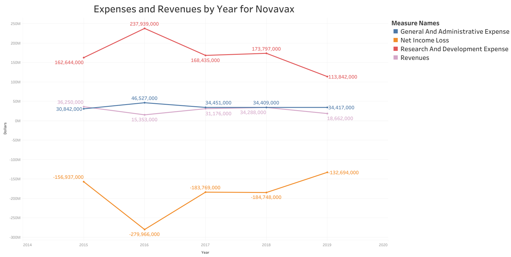

# Introduction
### Utilize the [FinnHub](https://finnhub.io/) API to gather data parsed out of 10K financial statements, then reformat that data into usable analysis. 
The purpose of this package is to use Finnhub's [Financials as Reported](https://finnhub.io/docs/api#financials-reported) endpoint to download the information that companies record in their 10K statements to CSV files. Filtering with: an industry, start year, end year, and list of keywords (concept list), the package creates a CSV file where each row is a company over multiple statements, and a CSV file where each row is a single 10K statement. To see what information the data holds, jump down to [Example Data Insights](#example-data-insights).

First the package pulls a list of ticker symbols from the [Stock Symbol](https://finnhub.io/docs/api#stock-symbols) endpoint. Next it adds overview data of the company using the [Company Profile 2](https://finnhub.io/docs/api#company-profile2) endpoint. One of the overview columns recorded is the companies Finnhub Industry. For a specific industry the package next collects all keyword-parsed 10K statements as JSON files from the aforementioned [Financials as Reported](https://finnhub.io/docs/api#financials-reported) endpoint.

With this JSON data in hand, the package reorganizes the data locally into a useful format. A HorizontalProfile object is created, with a start year, end year, and relevant concept list as filters for the data. The HorizontalProfile object uses Pandas Dataframes to organize and write a CSV file where each row is a company over multiple statements. Next, it quickly reorganizes the data into a "time series" format so that each row is a single 10K statement. Though the data in both CSV files is the same, it is useful to view the data from these two seperate lenses.

#### [This project is forked from a previous project I completed](https://github.com/award96/10K_financial_analysis)

# Installation
Download the package from GitHub, and get a [FinnHub](https://finnhub.io/) API key. Create a file named "api.txt" and store it in the same folder as the rest of the package. In this text file should be the API key and no other text or formatting.

# Usage

Add a file named "api.txt", it should contain your API key, by itself, on the first line
```
python main.py
```
And you're already downloading data. Edit the settings on main.py to suit your needs!
```
exchange - the exchange you want to pull data from (default: "US")
industry - the name of the Finnhub Industry you are interested in (default: "Biotechnology")
conceptList - the list of concepts you want to record data on. Concepts function as keys in the key-value pair system which Finnhub uses to organize its 10K data
```
Once the script is finished. Look at ```summary_output``` for a view company-centric view of the data, and ```timeseries_output``` for a statement-centric view

# Example Data Insights

## US Biotech Companies

How does Novavax, a breakout 2020 stock due to their Covid-19 vaccine, compare to other US Biotech companies?

### Novavax Spending and Earnings by Year for Key Measures

### How Those Measures Compare to Other US Biotech Companies

## S&P500 (All Industries)
### A histogram of the percent change of Net Income for NYSE companies over 2018-2019. Not every NYSE company was available through FinnHub. The high and low outliers have been excluded to fit the graph onto one page.


### A bar graph comparing the average percent change of Net Income for NYSE companies across industries for 2018-2019. Not every NYSE company was available through FinnHub. The number of companies behind each data point varies, the minimum being 10.


### A bar graph indicating the number of companies behind each data point of the previous graph
